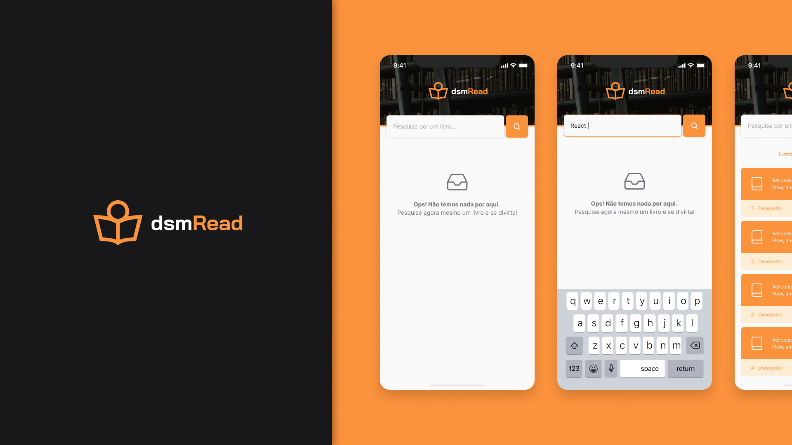

<h1 align="center">
  
</h1>

<h3 align="center">
  DSMRead 📖
</h3>

<p align="center">Aplicação mobile para leitura de notícias</p>

<p align="center">

<a href="https://www.linkedin.com/in/matheralvs/" target="_blank" rel="noopener noreferrer">

</a>
<a href="https://github.com/matheralvs/projeto-dsm/commits/main">

</a>
<a href="https://github.com/matheralvs/projeto-dsm/issues">

</a>
</p>

<p align="center">
<a href="#-sobre-o-projeto">Sobre o projeto</a> •
<a href="#-tecnologias">Tecnologias</a> •
<a href="#-layout-da-aplicação">Layout da aplicação</a> •
<a href="#-demonstração">Demonstração</a> •
<a href="#-como-começar">Como começar</a>
</p>

## ✅ Sobre o projeto

Este projeto é parte de um desafio do curso sobre criação de aplicações mobile com react native, ministrado pelo professor [Bruno Honorato](https://github.com/brunocastrohs). A proposta consistia em criar uma aplicação para leitura de noticias online, onde esta consumia uma API pública.

## 🎨 Layout da aplicação

O layout da aplicação no Figma se encontra nesse [link](https://www.figma.com/file/DgLdUb4tR4mTCndJNxqwh9/Projeto---DSM?type=design&node-id=0%3A1&mode=design&t=lI2zhRP9bsJaWufT-1).

## 📱 Demonstração

https://github.com/matheralvs/projeto-dsm/assets/109676973/d241c33d-432d-48da-a95d-582ddde3ee72

## 🚀 Tecnologias

Tecnologias que usei para desenvolver a aplicação:

- [ReactJS](https://pt-br.reactjs.org/)

- [React Native](https://reactnative.dev/)

- [Expo](https://docs.expo.dev/)

- [TypeScript](https://www.typescriptlang.org/)

- [Native Base](https://docs.nativebase.io/?utm_source=HomePage&utm_medium=header&utm_campaign=NativeBase_3)

- [Redux-Toolkit](https://redux-toolkit.js.org/introduction/getting-started)

## 💻 Como começar

**Clone o projeto e acesse a pasta:**

```bash

$ git clone https://github.com/matheralvs/projeto-dsm.git && cd projeto-dsm

```

**Siga os seguintes passos:**

```bash
# Install the dependencies

$ npm i

# To finish, run

$ npm run dev

# Well done, project is started!
```

## 🤔 Como contribuir

**Faça um fork deste repositório**

```bash
# Fork using GitHub official command line
# If you don't have the GitHub CLI, use the web site to do that.

$ gh repo fork matheralvs/projeto-dsm
```

**Logo em seguida**

```bash
# Clone your fork
$ git clone your-fork-url && cd projeto-dsm

# Create a branch with your feature
$ git checkout -b my-feature

# Make the commit with your changes
$ git commit -m 'Feature: My new feature'

# Send the code to your remote branch
$ git push origin my-feature
```

Depois que sua solicitação pull for mesclada, você poderá excluir sua branch.

Made with :purple_heart: by Matheus Alves 🤝 [See my linkedin](https://www.linkedin.com/in/matheralvs/)
